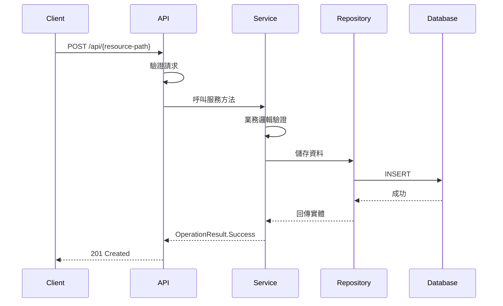
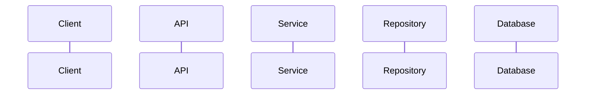
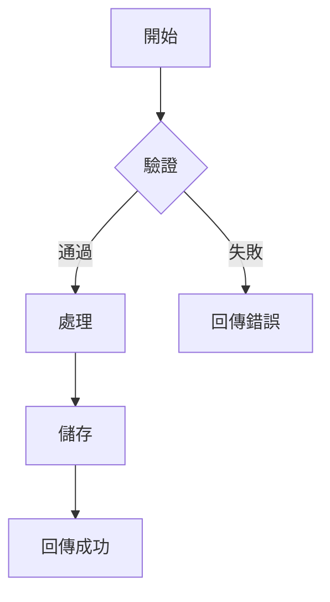

# 撰寫 API 文件: $arguments

一個用於為已實作的功能建立繁體中文 API 文件的範本。

## 目的

此指令用於建立完整的 API 文件，包含：
- 端點說明與使用範例
- 請求/回應格式與範例
- cURL 範例
- 驗證規則與錯誤處理
- Mermaid 流程圖（複雜操作）

## 流程

### 步驟 1：了解功能

在撰寫文件前，先了解功能：

1. **閱讀設計文件**（如有）：`docs/{feature-name}.md`
2. **檢視控制器**：了解所有端點
3. **檢視 DTOs**：了解請求/回應結構
4. **檢視驗證器**：了解驗證規則
5. **檢視服務層**：了解業務邏輯

### 步驟 2：建立 API 文件

在 `docs/api/` 目錄下建立新的 markdown 檔案，使用以下結構：

```markdown
# {功能名稱} API 文件

## 概述

簡要說明此 API 的用途與功能。

## 基本資訊

| 項目 | 說明 |
|------|------|
| 基礎路徑 | `/api/{resource-path}` |
| 授權需求 | {需要驗證/公開} |
| 支援格式 | JSON |

---

## 端點列表

| 方法 | 路徑 | 說明 | 授權 |
|------|------|------|------|
| GET | `/{resource-path}` | 取得列表 | {角色} |
| GET | `/{resource-path}/{id}` | 取得單一項目 | {角色} |
| POST | `/{resource-path}` | 建立新項目 | {角色} |
| PUT | `/{resource-path}/{id}` | 更新項目 | {角色} |
| DELETE | `/{resource-path}/{id}` | 刪除項目 | {角色} |

---

## 端點詳細說明

### 1. 取得列表

取得 {實體} 列表，支援分頁與篩選。

**端點**
```
GET /api/{resource-path}
```

**查詢參數**

| 參數 | 類型 | 必填 | 預設值 | 說明 |
|------|------|------|--------|------|
| page | int | 否 | 1 | 頁碼 |
| pageSize | int | 否 | 10 | 每頁筆數（最大 100） |
| {customParam} | string | 否 | - | {自訂參數說明} |

**回應範例**

```json
{
  "isSuccess": true,
  "code": 200,
  "data": {
    "items": [
      {
        "id": "xxx-guid-xxx",
        "field1": "value1",
        "field2": "value2",
        "createdAt": "2025-01-01T00:00:00Z",
        "updatedAt": "2025-01-01T00:00:00Z"
      }
    ],
    "page": 1,
    "pageSize": 10,
    "totalCount": 100,
    "totalPages": 10
  },
  "errorMessage": null
}
```

**cURL 範例**

```bash
# 取得第一頁，每頁 10 筆
curl -X GET "http://localhost:5155/api/{resource-path}?page=1&pageSize=10" \
  -H "Accept: application/json"

# 使用篩選條件
curl -X GET "http://localhost:5155/api/{resource-path}?{customParam}=value" \
  -H "Accept: application/json"
```

---

### 2. 取得單一項目

根據 ID 取得單一 {實體}。

**端點**
```
GET /api/{resource-path}/{id}
```

**路徑參數**

| 參數 | 類型 | 必填 | 說明 |
|------|------|------|------|
| id | string | 是 | {實體} 的唯一識別碼 |

**回應範例**

成功（200 OK）：
```json
{
  "isSuccess": true,
  "code": 200,
  "data": {
    "id": "xxx-guid-xxx",
    "field1": "value1",
    "field2": "value2",
    "createdAt": "2025-01-01T00:00:00Z",
    "updatedAt": "2025-01-01T00:00:00Z"
  },
  "errorMessage": null
}
```

找不到（404 Not Found）：
```json
{
  "isSuccess": false,
  "code": 404,
  "data": null,
  "errorMessage": "找不到指定的 {實體}"
}
```

**cURL 範例**

```bash
curl -X GET "http://localhost:5155/api/{resource-path}/xxx-guid-xxx" \
  -H "Accept: application/json"
```

---

### 3. 建立新項目

建立新的 {實體}。

**端點**
```
POST /api/{resource-path}
```

**請求主體**

| 欄位 | 類型 | 必填 | 說明 | 驗證規則 |
|------|------|------|------|----------|
| field1 | string | 是 | {說明} | 最大 100 字元 |
| field2 | string | 否 | {說明} | - |

**請求範例**

```json
{
  "field1": "value1",
  "field2": "value2"
}
```

**回應範例**

成功（201 Created）：
```json
{
  "isSuccess": true,
  "code": 201,
  "data": {
    "id": "xxx-guid-xxx",
    "field1": "value1",
    "field2": "value2",
    "createdAt": "2025-01-01T00:00:00Z",
    "updatedAt": "2025-01-01T00:00:00Z"
  },
  "errorMessage": null
}
```

驗證失敗（400 Bad Request）：
```json
{
  "type": "https://tools.ietf.org/html/rfc9110#section-15.5.1",
  "title": "One or more validation errors occurred.",
  "status": 400,
  "errors": {
    "Field1": ["Field1 是必填欄位"]
  }
}
```

**cURL 範例**

```bash
curl -X POST "http://localhost:5155/api/{resource-path}" \
  -H "Content-Type: application/json" \
  -H "Accept: application/json" \
  -d '{
    "field1": "value1",
    "field2": "value2"
  }'
```

---

### 4. 更新項目

更新現有的 {實體}。

**端點**
```
PUT /api/{resource-path}/{id}
```

**路徑參數**

| 參數 | 類型 | 必填 | 說明 |
|------|------|------|------|
| id | string | 是 | {實體} 的唯一識別碼 |

**請求主體**

| 欄位 | 類型 | 必填 | 說明 | 驗證規則 |
|------|------|------|------|----------|
| field1 | string | 否 | {說明} | 最大 100 字元 |
| field2 | string | 否 | {說明} | - |

**請求範例**

```json
{
  "field1": "updated value"
}
```

**回應範例**

成功（200 OK）：
```json
{
  "isSuccess": true,
  "code": 200,
  "data": {
    "id": "xxx-guid-xxx",
    "field1": "updated value",
    "field2": "value2",
    "createdAt": "2025-01-01T00:00:00Z",
    "updatedAt": "2025-01-02T00:00:00Z"
  },
  "errorMessage": null
}
```

**cURL 範例**

```bash
curl -X PUT "http://localhost:5155/api/{resource-path}/xxx-guid-xxx" \
  -H "Content-Type: application/json" \
  -H "Accept: application/json" \
  -d '{
    "field1": "updated value"
  }'
```

---

### 5. 刪除項目

刪除指定的 {實體}。

**端點**
```
DELETE /api/{resource-path}/{id}
```

**路徑參數**

| 參數 | 類型 | 必填 | 說明 |
|------|------|------|------|
| id | string | 是 | {實體} 的唯一識別碼 |

**回應範例**

成功（204 No Content）：
```
（無回應主體）
```

找不到（404 Not Found）：
```json
{
  "isSuccess": false,
  "code": 404,
  "data": null,
  "errorMessage": "找不到指定的 {實體}"
}
```

**cURL 範例**

```bash
curl -X DELETE "http://localhost:5155/api/{resource-path}/xxx-guid-xxx" \
  -H "Accept: application/json"
```

---

## 資料模型

### {EntityName}Dto

| 欄位 | 類型 | 說明 |
|------|------|------|
| id | string | 唯一識別碼 |
| field1 | string | {說明} |
| field2 | string | {說明} |
| createdAt | datetime | 建立時間 (UTC) |
| updatedAt | datetime | 更新時間 (UTC) |

### Create{EntityName}Dto

| 欄位 | 類型 | 必填 | 說明 | 驗證規則 |
|------|------|------|------|----------|
| field1 | string | 是 | {說明} | 不可為空，最大 100 字元 |
| field2 | string | 否 | {說明} | 最大 500 字元 |

### Update{EntityName}Dto

| 欄位 | 類型 | 必填 | 說明 | 驗證規則 |
|------|------|------|------|----------|
| field1 | string | 否 | {說明} | 提供時最大 100 字元 |
| field2 | string | 否 | {說明} | 提供時最大 500 字元 |

---

## 驗證規則

### 建立時驗證
- `field1`：必填，最大 100 字元
- `field2`：選填，最大 500 字元

### 更新時驗證
- 所有欄位皆為選填
- 提供的欄位必須符合長度限制

### 業務規則
- {列出業務規則}
- {例如：名稱不可重複}

---

## 錯誤處理

### 標準錯誤回應

所有錯誤回應遵循 `OperationResult<T>` 格式：

```json
{
  "isSuccess": false,
  "code": {HTTP狀態碼},
  "data": null,
  "errorMessage": "{錯誤訊息}"
}
```

### 常見錯誤碼

| HTTP 狀態碼 | 說明 | 可能原因 |
|-------------|------|----------|
| 400 | Bad Request | 請求格式錯誤或驗證失敗 |
| 401 | Unauthorized | 未提供或無效的驗證憑證 |
| 403 | Forbidden | 無權限執行此操作 |
| 404 | Not Found | 找不到指定的資源 |
| 409 | Conflict | 資源衝突（如名稱重複） |
| 500 | Internal Server Error | 伺服器內部錯誤 |

### 驗證錯誤回應

驗證失敗時回傳 ProblemDetails 格式：

```json
{
  "type": "https://tools.ietf.org/html/rfc9110#section-15.5.1",
  "title": "One or more validation errors occurred.",
  "status": 400,
  "errors": {
    "FieldName": ["錯誤訊息1", "錯誤訊息2"]
  }
}
```

---

## 流程圖（如適用）

### {操作名稱}流程



---

## 使用範例

### 情境 1：建立並查詢

```bash
# 1. 建立新項目
curl -X POST "http://localhost:5155/api/{resource-path}" \
  -H "Content-Type: application/json" \
  -d '{"field1": "測試項目"}'

# 2. 查詢列表確認
curl -X GET "http://localhost:5155/api/{resource-path}"
```

### 情境 2：更新項目

```bash
# 1. 取得項目
curl -X GET "http://localhost:5155/api/{resource-path}/xxx-guid-xxx"

# 2. 更新項目
curl -X PUT "http://localhost:5155/api/{resource-path}/xxx-guid-xxx" \
  -H "Content-Type: application/json" \
  -d '{"field1": "更新後的值"}'
```

---

## 注意事項

- 所有時間戳記皆為 UTC 格式
- ID 為系統自動產生的 GUID
- 分頁查詢時，`pageSize` 最大值為 100
- 刪除操作為軟刪除/硬刪除（依實作而定）

---

## 相關文件

- [設計文件](../{feature-name}.md)
- [其他相關 API](./related-api.md)

> **注意**：API 文件統一存放於 `docs/api/` 目錄下

---

## 版本紀錄

| 版本 | 日期 | 說明 |
|------|------|------|
| 1.0 | {日期} | 初始版本 |
```

### 步驟 3：文件檢查清單

撰寫完成後，確認文件包含：

- [ ] 概述與基本資訊
- [ ] 完整的端點列表表格
- [ ] 每個端點的詳細說明
- [ ] 請求/回應範例（JSON 格式）
- [ ] cURL 範例
- [ ] 資料模型說明
- [ ] 驗證規則
- [ ] 錯誤處理說明
- [ ] 流程圖（複雜操作）
- [ ] 使用情境範例

### 步驟 4：測試 cURL 範例

確保所有 cURL 範例都能正確執行：

```bash
# 啟動 API
dotnet run --project Dotnet10AISamples.Api

# 在另一個終端測試 cURL 範例
```

## 文件慣例

### 檔案命名
- 檔案位置：`docs/api/{feature-name}.md`
- 命名規則：使用 kebab-case（例如：`user-management.md`）

### 語言
- 文件內容使用**繁體中文**
- 程式碼、API 路徑、欄位名稱保持英文
- 錯誤訊息可使用中英文混合

### 格式規範
- 使用 Markdown 表格呈現結構化資訊
- JSON 範例使用程式碼區塊並標註語言
- cURL 範例包含完整的 headers
- 流程圖使用 Mermaid 語法

## 常用 Mermaid 圖表

### 序列圖（API 流程）



### 流程圖（業務邏輯）



## 範例參考

建立文件時可參考 `docs/api/` 目錄下的現有文件（如有）。

## 最後提醒

- **保持文件與程式碼同步**：程式碼變更時更新文件
- **測試所有範例**：確保 cURL 範例可正確執行
- **使用一致的格式**：遵循專案既有的文件風格
- **包含實際值範例**：使用合理的範例資料，而非 placeholder
