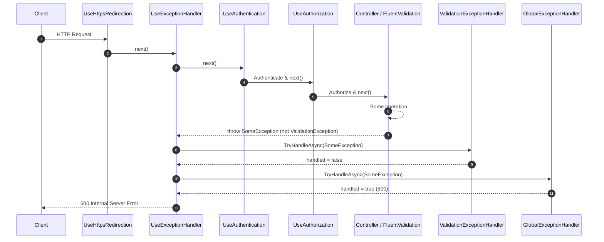

# GlobalExceptionHandler 使用指南

- https://learn.microsoft.com/zh-tw/aspnet/core/fundamentals/error-handling?view=aspnetcore-10.0#iexceptionhandler
- https://learn.microsoft.com/zh-tw/aspnet/core/fundamentals/error-handling?view=aspnetcore-10.0#problem-details
- https://learn.microsoft.com/zh-tw/aspnet/core/fundamentals/error-handling?view=aspnetcore-10.0#problem-details

## 概述

`GlobalExceptionHandler` 是一個全域異常處理中介軟體，實作了 `IExceptionHandler` 介面。它負責捕獲應用程式中未處理的異常，記錄錯誤日誌，並回傳標準化的 `ProblemDetails` 回應。

## 請求流程圖



## 類別結構

```csharp
public sealed class GlobalExceptionHandler(
    IProblemDetailsService problemDetailsService,
    ILogger<GlobalExceptionHandler> logger) : IExceptionHandler
{
    public async ValueTask<bool> TryHandleAsync(HttpContext httpContext, Exception exception,
        CancellationToken cancellationToken)
    {
        // 記錄錯誤日誌
        logger.LogError(
            exception,
            "Unhandled exception while processing {Method} {Path}. TraceId: {TraceId}",
            httpContext.Request?.Method,
            httpContext.Request?.Path.Value,
            httpContext.TraceIdentifier);

        // 寫入 ProblemDetails 回應
        return await problemDetailsService.TryWriteAsync(new ProblemDetailsContext()
        {
            HttpContext = httpContext,
            Exception = exception,
            ProblemDetails = new ProblemDetails()
            {
                Title = "Internal Server Error",
                Detail = "An Error occurred while processing the request. Please contact the administrator.",
            }
        });
    }
}
```

## 功能說明

- **異常捕獲**: 自動捕獲應用程式中未被其他處理器處理的異常。
- **日誌記錄**: 使用結構化日誌記錄異常詳細資訊，包括請求方法、路徑和追蹤 ID。
- **標準化回應**: 回傳符合 RFC 7807 的 `ProblemDetails` 格式錯誤回應。

## 註冊方式

在 `Program.cs` 中註冊中介軟體：

```csharp
builder.Services.AddExceptionHandler<GlobalExceptionHandler>();
builder.Services.AddProblemDetails();
```

確保在中介軟體管道中正確配置：

```csharp
app.UseExceptionHandler();
app.UseStatusCodePages();
```

## 使用情境

當應用程式發生未預期的異常時，`GlobalExceptionHandler` 會：

1. 記錄異常詳細資訊到日誌系統
2. 設定 HTTP 狀態碼為 500 (Internal Server Error)
3. 回傳標準化的錯誤回應

### 範例回應

```json
{
  "type": "https://tools.ietf.org/html/rfc7231#section-6.6.1",
  "title": "Internal Server Error",
  "status": 500,
  "detail": "An Error occurred while processing the request. Please contact the administrator.",
  "traceId": "00-1234567890abcdef1234567890abcdef-1234567890abcdef-00"
}
```

## 與其他異常處理器的整合

`GlobalExceptionHandler` 應作為最後的異常處理器。在它之前，可以有特定的異常處理器，如 `ValidationExceptionHandler`。

### 異常處理順序

1. `ValidationExceptionHandler`: 處理驗證相關異常
2. `GlobalExceptionHandler`: 處理其他未處理異常

## 最佳實踐

1. 確保 `GlobalExceptionHandler` 在中介軟體管道中正確配置。
2. 使用結構化日誌記錄異常資訊，便於監控和除錯。
3. 在開發環境中，可以配置更詳細的錯誤資訊。
4. 避免在生產環境中洩露敏感資訊。

## 相關檔案

- `Dotnet10AISamples.Api/Middlewares/GlobalExceptionHandler.cs`: 全域異常處理器實作
- `Dotnet10AISamples.Api/Middlewares/ValidationExceptionHandler.cs`: 驗證異常處理器
- `Dotnet10AISamples.Api/Program.cs`: 中介軟體註冊
