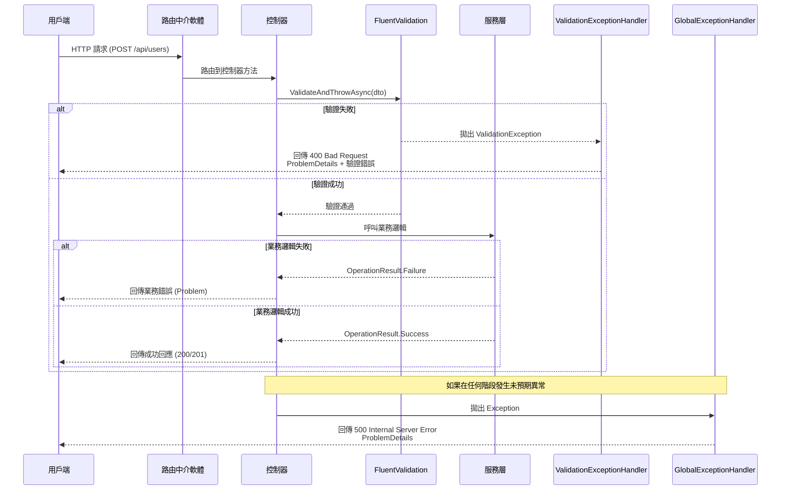

# ASP.NET Core 中介軟體請求管道詳解

## 概述

在 `Dotnet10AISamples.Api` 專案中，請求從接收到回應的整個流程涉及多個中介軟體和處理器。本文件將詳細說明請求管道的運作方式，特別針對驗證輸入到回傳回應的過程，幫助新手開發者理解 ASP.NET Core 的請求處理機制。

## 請求管道概覽

ASP.NET Core 的請求管道是一個中介軟體鏈，每個中介軟體都可以處理請求或將請求傳遞給下一個中介軟體。在我們的專案中，主要的中介軟體包括：

1. **路由中介軟體** - 確定請求應由哪個控制器處理
2. **驗證中介軟體** - 處理輸入驗證
3. **異常處理中介軟體** - 處理各種異常情況
4. **控制器** - 執行業務邏輯

## 詳細請求流程

### 階段 1: 請求接收

當用戶端發送 HTTP 請求時：

```http
POST /api/users
Content-Type: application/json

{
  "username": "",
  "email": "invalid-email"
}
```

請求首先到達 ASP.NET Core 應用程式。

### 階段 2: 路由與模型繫結

1. **路由中介軟體** 分析 URL (`/api/users`) 和 HTTP 方法 (`POST`)
2. 確定應由 `UsersController.CreateUser` 方法處理
3. **模型繫結器** 將 JSON 請求體轉換為 `CreateUserDto` 物件

```csharp
[HttpPost]
public async Task<IActionResult> CreateUser(CreateUserDto createUserDto,
    IValidator<CreateUserDto> validator)
```

### 階段 3: 輸入驗證

控制器方法接收到 `CreateUserDto` 實例和 `IValidator<CreateUserDto>` 驗證器：

```csharp
await validator.ValidateAndThrowAsync(createUserDto);
```

**FluentValidation 驗證器** 檢查輸入：

```csharp
public class CreateUserDtoValidator : AbstractValidator<CreateUserDto>
{
    public CreateUserDtoValidator()
    {
        RuleFor(x => x.Username)
            .NotEmpty().WithMessage("使用者名稱不能為空")
            .MinimumLength(3).WithMessage("使用者名稱至少需要3個字元");

        RuleFor(x => x.Email)
            .NotEmpty().WithMessage("電子郵件不能為空")
            .EmailAddress().WithMessage("電子郵件格式不正確");
    }
}
```

### 階段 4: 驗證失敗處理

如果驗證失敗：

1. `ValidateAndThrowAsync` 拋出 `ValidationException`
2. 異常向上傳播，跳過控制器其餘邏輯
3. **ValidationExceptionHandler** 捕獲異常

```csharp
public sealed class ValidationExceptionHandler(IProblemDetailsService problemDetailsService) : IExceptionHandler
{
    public async ValueTask<bool> TryHandleAsync(HttpContext httpContext, Exception exception,
        CancellationToken cancellationToken)
    {
        if (exception is not ValidationException validationException)
        {
            return false; // 傳遞給下一個處理器
        }

        // 設定狀態碼為 400
        httpContext.Response.StatusCode = StatusCodes.Status400BadRequest;

        // 建立 ProblemDetails 內容
        var context = new ProblemDetailsContext
        {
            HttpContext = httpContext,
            Exception = exception,
            ProblemDetails = new ProblemDetails()
            {
                Title = "One or more validation errors occurred.",
                Status = StatusCodes.Status400BadRequest,
            }
        };

        // 格式化驗證錯誤
        var errors = validationException.Errors
            .GroupBy(e => e.PropertyName)
            .ToDictionary(
                g => g.Key.ToLowerInvariant(),
                g => g.Select(e => e.ErrorMessage).ToArray()
            );

        context.ProblemDetails.Extensions.Add("errors", errors);

        // 寫入回應
        return await problemDetailsService.TryWriteAsync(context);
    }
}
```

**回應範例**：

```http
HTTP/1.1 400 Bad Request
Content-Type: application/problem+json

{
  "type": "https://tools.ietf.org/html/rfc7231#section-6.5.1",
  "title": "One or more validation errors occurred.",
  "status": 400,
  "errors": {
    "username": ["使用者名稱不能為空", "使用者名稱至少需要3個字元"],
    "email": ["電子郵件格式不正確"]
  }
}
```

### 階段 5: 驗證成功後的處理

如果驗證通過：

1. 控制器繼續執行業務邏輯
2. 呼叫服務層方法
3. 處理可能的業務邏輯錯誤

```csharp
var result = await _userService.CreateUserAsync(user);
if (!result.IsSuccess)
{
    return Problem(
        detail: result.ErrorMessage,
        statusCode: result.StatusCode
    );
}

return CreatedAtAction(nameof(GetUser), new { id = result.Data!.Id }, result.Data);
```

### 階段 6: 其他異常處理

如果在業務邏輯中發生未預期的異常：

1. 異常向上傳播
2. **GlobalExceptionHandler** 捕獲所有未處理的異常

```csharp
public sealed class GlobalExceptionHandler(
    IProblemDetailsService problemDetailsService,
    ILogger<GlobalExceptionHandler> logger) : IExceptionHandler
{
    public async ValueTask<bool> TryHandleAsync(HttpContext httpContext, Exception exception,
        CancellationToken cancellationToken)
    {
        // 記錄錯誤日誌
        logger.LogError(
            exception,
            "Unhandled exception while processing {Method} {Path}. TraceId: {TraceId}",
            httpContext.Request?.Method,
            httpContext.Request?.Path.Value,
            httpContext.TraceIdentifier);

        // 回傳通用錯誤回應
        return await problemDetailsService.TryWriteAsync(new ProblemDetailsContext()
        {
            HttpContext = httpContext,
            Exception = exception,
            ProblemDetails = new ProblemDetails()
            {
                Title = "Internal Server Error",
                Detail = "An Error occurred while processing the request. Please contact the administrator.",
            }
        });
    }
}
```

## 中介軟體註冊順序

在 `Program.cs` 中的註冊順序很重要：

```csharp
// 服務註冊
builder.Services.AddExceptionHandler<ValidationExceptionHandler>();
builder.Services.AddExceptionHandler<GlobalExceptionHandler>();
builder.Services.AddProblemDetails();

// 中介軟體管道
app.UseExceptionHandler(); // 必須在其他中介軟體之前
app.UseHttpsRedirection();
app.UseAuthorization();
app.MapControllers();
```

**為什麼順序重要？**

1. `ValidationExceptionHandler` 在 `GlobalExceptionHandler` 之前註冊
2. 這樣驗證異常會被特定的處理器捕獲
3. 其他異常才會被全域處理器處理

## OperationResult 和 ApiResponse 的角色

專案使用 `OperationResult<T>` 作為服務層的一致回應格式，`ApiResponse<T>` 作為 API 呈現層的回應格式：

### OperationResult<T> (服務層)

```csharp
public class OperationResult<T>
{
    public bool IsSuccess { get; }
    public T Data { get; }
    public string ErrorMessage { get; }
    public int Code { get; }

    public static OperationResult<T> Success(T data, int statusCode = 200) =>
        new OperationResult<T>(true, data, null, statusCode);

    public static OperationResult<T> Failure(string errorMessage = "Operation Failed.", int statusCode = 400) =>
        new OperationResult<T>(false, default, errorMessage, statusCode);
}
```

### ApiResponse<T> (API 層)

```csharp
public class ApiResponse<T>
{
    public T Data { get; set; }
    public string Message { get; set; }
    public int Code { get; set; }
}
```

在控制器中使用：

```csharp
[HttpGet]
public IActionResult Get()
{
    var result = _service.GetWeatherForecasts();
    if (!result.IsSuccess)
    {
        return Problem(detail: result.ErrorMessage, statusCode: result.Code);
    }

    return Ok(new ApiResponse<IEnumerable<WeatherForecast>>
    {
        Data = result.Data,
        Message = "Weather forecasts retrieved successfully",
        Code = 200
    });
}
```

## 完整流程圖



## 開發者注意事項

### 新手常見問題

1. **為什麼驗證錯誤沒有被處理？**

   - 確保 `ValidationExceptionHandler` 已正確註冊
   - 檢查驗證器是否正確注入

2. **為什麼拋出 ValidationException 後程式繼續執行？**

   - `ValidateAndThrowAsync` 會中斷執行流程
   - 確保沒有 try-catch 包圍驗證呼叫

3. **如何除錯中介軟體？**
   - 使用日誌記錄中間狀態
   - 在開發環境中啟用詳細錯誤

### 最佳實踐

1. 總是在控制器方法開始處進行驗證
2. 使用有意義的驗證錯誤訊息
3. 在服務層使用 `OperationResult<T>` 處理業務錯誤
4. 記錄足夠的日誌資訊以便除錯
5. 在開發環境測試所有錯誤路徑

## 相關檔案

- `Dotnet10AISamples.Api/Program.cs`: 中介軟體註冊
- `Dotnet10AISamples.Api/Middlewares/ValidationExceptionHandler.cs`: 驗證異常處理
- `Dotnet10AISamples.Api/Middlewares/GlobalExceptionHandler.cs`: 全域異常處理
- `Dotnet10AISamples.Api/Common/OperationResult.cs`: 統一回應格式
- `Dotnet10AISamples.Api/Controllers/`: 控制器範例
