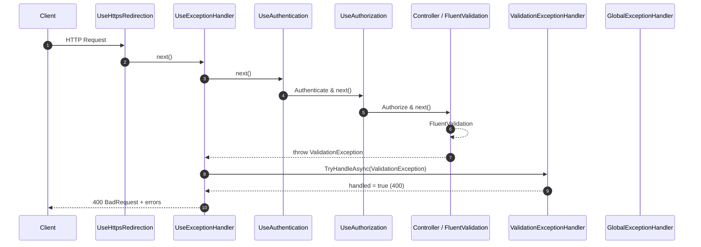

# ValidationExceptionHandler 使用指南

- https://learn.microsoft.com/zh-tw/aspnet/core/fundamentals/error-handling?view=aspnetcore-10.0#iexceptionhandler

## 概述

`ValidationExceptionHandler` 是一個專門處理驗證異常的中介軟體，實作了 `IExceptionHandler` 介面。它負責捕獲 `FluentValidation` 拋出的 `ValidationException`，並將驗證錯誤以標準化的 `ProblemDetails` 格式回傳。

## 請求流程圖



## 類別結構

```csharp
public sealed class ValidationExceptionHandler(IProblemDetailsService problemDetailsService) : IExceptionHandler
{
    public async ValueTask<bool> TryHandleAsync(HttpContext httpContext, Exception exception,
        CancellationToken cancellationToken)
    {
        if (exception is not ValidationException validationException)
        {
            return false; // 不處理非驗證異常
        }

        httpContext.Response.StatusCode = StatusCodes.Status400BadRequest;
        var context = new ProblemDetailsContext
        {
            HttpContext = httpContext,
            Exception = exception,
            ProblemDetails = new ProblemDetails()
            {
                Title = "One or more validation errors occurred.",
                Status = StatusCodes.Status400BadRequest,
            }
        };

        // 將驗證錯誤分組並加入到 extensions
        var errors = validationException.Errors
            .GroupBy(e => e.PropertyName)
            .ToDictionary(
                g => g.Key.ToLowerInvariant(),
                g => g.Select(e => e.ErrorMessage).ToArray()
            );
        context.ProblemDetails.Extensions.Add("errors", errors);
        return await problemDetailsService.TryWriteAsync(context);
    }
}
```

## 功能說明

- **驗證異常捕獲**: 專門處理 `FluentValidation.ValidationException`。
- **狀態碼設定**: 設定 HTTP 狀態碼為 400 (Bad Request)。
- **錯誤格式化**: 將驗證錯誤按屬性名稱分組，並以字典格式加入 `ProblemDetails.Extensions`。
- **標準化回應**: 回傳符合 RFC 7807 的 `ProblemDetails` 格式。

## 註冊方式

在 `Program.cs` 中註冊中介軟體：

```csharp
builder.Services.AddExceptionHandler<ValidationExceptionHandler>();
builder.Services.AddProblemDetails();
```

確保在異常處理管道中，`ValidationExceptionHandler` 優先於 `GlobalExceptionHandler`：

```csharp
app.UseExceptionHandler();
```

## 使用情境

當使用 `FluentValidation` 的驗證器拋出 `ValidationException` 時，`ValidationExceptionHandler` 會：

1. 檢查異常類型是否為 `ValidationException`
2. 設定狀態碼為 400
3. 將驗證錯誤分組並格式化
4. 回傳包含錯誤詳細資訊的 `ProblemDetails`

### 範例回應

```json
{
  "type": "https://tools.ietf.org/html/rfc7231#section-6.5.1",
  "title": "One or more validation errors occurred.",
  "status": 400,
  "errors": {
    "username": [
      "Username is required.",
      "Username must be at least 3 characters long."
    ],
    "email": ["Email is not in the correct format."]
  }
}
```

## 與 FluentValidation 的整合

`ValidationExceptionHandler` 專為 `FluentValidation` 設計。當驗證器失敗時：

```csharp
public class UserValidator : AbstractValidator<User>
{
    public UserValidator()
    {
        RuleFor(u => u.Username)
            .NotEmpty().WithMessage("Username is required.")
            .MinimumLength(3).WithMessage("Username must be at least 3 characters long.");

        RuleFor(u => u.Email)
            .EmailAddress().WithMessage("Email is not in the correct format.");
    }
}
```

在控制器中：

```csharp
[HttpPost]
public async Task<IActionResult> CreateUser(CreateUserDto createUserDto,
    IValidator<CreateUserDto> validator)
{
    await validator.ValidateAndThrowAsync(createUserDto);

    var user = new User
    {
        Username = createUserDto.Username,
        Email = createUserDto.Email,
        // 其他屬性...
    };

    var result = await _userService.CreateUserAsync(user);
    if (!result.IsSuccess)
    {
        return Problem(
            detail: result.ErrorMessage,
            statusCode: result.StatusCode
        );
    }

    return CreatedAtAction(nameof(GetUser), new { id = result.Data!.Id }, result.Data);
}
```

另一個範例，使用 PUT 方法更新使用者：

```csharp
[HttpPut("{id}")]
public async Task<IActionResult> UpdateUser(int id, UpdateUserDto updateUserDto,
    IValidator<UpdateUserDto> validator)
{
    await validator.ValidateAndThrowAsync(updateUserDto);

    var existingUser = await _userService.GetUserByIdAsync(id);
    if (!existingUser.IsSuccess)
    {
        return NotFound(new { message = "User not found" });
    }

    var updateResult = await _userService.UpdateUserAsync(id, updateUserDto);
    if (!updateResult.IsSuccess)
    {
        return Problem(
            detail: updateResult.ErrorMessage,
            statusCode: updateResult.StatusCode
        );
    }

    return NoContent();
}
```

## 異常處理順序

1. `ValidationExceptionHandler`: 處理驗證異常
2. `GlobalExceptionHandler`: 處理其他未處理異常

## 最佳實踐

1. 在控制器中使用 `FluentValidation` 進行輸入驗證。
2. 當驗證失敗時，拋出 `ValidationException` 以觸發處理器。
3. 提供清晰的驗證錯誤訊息。
4. 確保 `ValidationExceptionHandler` 在 `GlobalExceptionHandler` 之前註冊。

## 相關檔案

- `Dotnet10AISamples.Api/Middlewares/ValidationExceptionHandler.cs`: 驗證異常處理器實作
- `Dotnet10AISamples.Api/Middlewares/GlobalExceptionHandler.cs`: 全域異常處理器
- `Dotnet10AISamples.Api/Program.cs`: 中介軟體註冊
